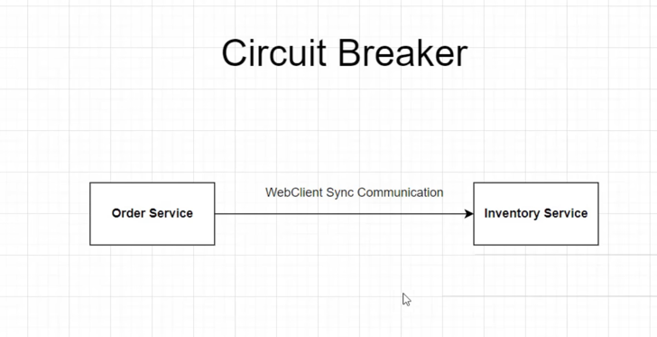

# Spring Boot Microservices
Original repo and tutorial by: https://github.com/s4kibs4mi/

This repository contains the latest source code of the spring-boot-microservices tutorial

You can watch the tutorial on Youtube here - https://www.youtube.com/watch?v=mPPhcU7oWDU

## How to run the application using Docker

1. Run `mvn clean package -DskipTests` to build the applications and create the docker image locally.
2. Run `docker-compose up -d` to start the applications.

## How to run the application without Docker

1. Run `mvn clean verify -DskipTests` by going inside each folder to build the applications.
2. After that run `mvn spring-boot:run` by going inside each folder to start the applications.

We introduce an API Gateway below.

Benefits of API Gateway shown below.

Secure Services by adding an Auth Server (KeyCloak)

Introduces Circuit Breaker for resilient communication between services. 
Open state = Won't allow calls for a certain duration
Half Open = Goes to this state after being in Open State for a certain duration

Introduces a way to track down issues related to performances using distributed tracing (tracks request from start to finish).
Uses Spring Cloud Sleuth and Zipkin (UI to visualize this information)

Implement event driven architecture

Dockerize the components
